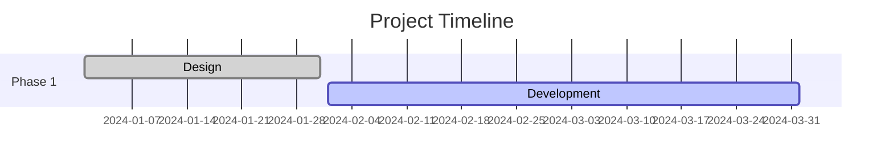

# CLAUDE.md - AI Assistant Guide for MDNotes Pro

## Project Overview

**MDNotes Pro** (v2.0.0) is a professional, modular, browser-based Markdown editor with advanced presentation and visualization capabilities. It combines:

- **CodeMirror Editor** with syntax highlighting and shortcuts
- **Live Preview** with Mermaid diagrams and Chart.js
- **Presentation Mode** powered by Reveal.js
- **Mindmap Visualization** using markmap
- **Advanced Export** (MD, HTML, PDF, PowerPoint)
- **Multi-file Management** with localStorage
- **Fullscreen Modes** for all panels
- **Timeline & Gantt** chart support
- **5 Themes** (dark, light, dracula, nord, monokai)

The application uses a **modular architecture** with source files in `src/` that are bundled into a single `dist/index.html` file (~100KB) via Node.js build script.

## Architecture Overview

### New Modular Structure (v2.0.0)

```
mdnotes/
├── src/                    # Source files (EDIT THESE)
│   ├── css/               # Stylesheets
│   │   ├── variables.css  # CSS variables & themes
│   │   ├── base.css       # Base styles & reset
│   │   ├── components.css # UI components
│   │   └── modals.css     # Modal dialogs
│   ├── js/                # JavaScript modules
│   │   ├── modules/       # Core functionality
│   │   │   ├── storage.js        # localStorage operations
│   │   │   ├── theme.js          # Theme management
│   │   │   ├── file-manager.js   # File operations
│   │   │   ├── editor.js         # CodeMirror editor
│   │   │   ├── preview.js        # Markdown preview
│   │   │   ├── mindmap.js        # Mindmap visualization
│   │   │   ├── presentation.js   # Reveal.js integration
│   │   │   └── export.js         # Export functionality
│   │   ├── extensions/    # Optional features
│   │   │   ├── charts.js        # Chart.js integration
│   │   │   └── timeline.js      # Timeline support
│   │   └── app.js         # Main application class
│   └── html/              # HTML components
│       ├── template.html  # Main HTML template
│       ├── modals.html    # Modal HTML
│       └── icons.html     # SVG icon sprites
├── build/                 # Build system
│   ├── build.js          # Production build script
│   └── watch.js          # Development watcher
├── dist/                  # Built files (OUTPUT)
│   └── index.html        # Single-file application
├── index.html            # Original v1.x file (deprecated)
├── package.json          # Project configuration
├── README.md             # User documentation
├── TODO.md               # Task list
└── CLAUDE.md             # This file
```

### Build System

The project uses a Node.js build script that:

1. Reads `src/html/template.html` as base
2. Bundles all CSS files from `src/css/`
3. Bundles all JS modules from `src/js/`
4. Inlines modals and icons from `src/html/`
5. Replaces placeholders in template
6. Outputs single `dist/index.html` file

**Commands:**
```bash
npm run build   # Production build
npm run watch   # Development mode with auto-rebuild
npm run dev     # Build + HTTP server on port 8000
```

## Core Modules

### Storage Module (`src/js/modules/storage.js`)

Handles all localStorage operations.

**Key Functions:**
- `loadFiles()` - Load files from localStorage
- `saveFiles(files)` - Save files to localStorage
- `loadSettings()` - Load user settings
- `saveSettings(settings)` - Save user settings
- `getStorageInfo()` - Get storage usage statistics

**LocalStorage Keys:**
- `mdnotes_files` - All markdown files
- `mdnotes_settings_v2` - User settings

### Theme Module (`src/js/modules/theme.js`)

Manages application themes.

**Key Functions:**
- `apply(themeName)` - Apply a theme
- `getCurrent()` - Get current theme name
- `getAll()` - Get all available themes

**Available Themes:**
- `dark` - Default dark theme
- `light` - Light theme
- `dracula` - Dracula color scheme
- `nord` - Nord color palette
- `monokai` - Monokai inspired

**Adding a New Theme:**
1. Add to `themes` object in `theme.js`
2. Add CSS variables in `src/css/variables.css`
3. Add preset button in `src/html/modals.html`
4. Rebuild with `npm run build`

### File Manager Module (`src/js/modules/file-manager.js`)

Manages file operations and UI.

**Class: `FileManager`**

**Key Methods:**
- `init()` - Initialize file manager
- `render()` - Render file list UI
- `switchFile(filename)` - Switch to different file
- `createFile(filename, content)` - Create new file
- `deleteFile(filename)` - Delete file
- `saveCurrentFile(content)` - Save current file
- `loadExternalFiles(fileList)` - Import external files
- `toggleVisibility()` - Show/hide file manager

**Callbacks:**
- `onFileChange` - Called when file switches

### Editor Module (`src/js/modules/editor.js`)

Manages the CodeMirror editor (with fallback to textarea).

**Class: `Editor`**

**Key Methods:**
- `init()` - Initialize editor (tries CodeMirror, falls back to textarea)
- `getValue()` - Get editor content
- `setValue(content)` - Set editor content
- `insertMarkdown(prefix, suffix, placeholder)` - Insert formatting
- `setTheme(theme)` - Change editor theme
- `setFontSize(size)` - Change font size
- `setFontFamily(family)` - Change font family
- `refresh()` - Refresh editor
- `getStats()` - Get lines, words, chars
- `toggleFullscreen()` - Toggle fullscreen mode

**CodeMirror Features:**
- Line numbers
- Syntax highlighting (markdown mode)
- Auto-close brackets
- Active line highlighting
- Match highlighting
- Keyboard shortcuts (Ctrl+B, Ctrl+I, Ctrl+K)

### Preview Module (`src/js/modules/preview.js`)

Renders markdown to HTML with diagrams and charts.

**Class: `Preview`**

**Key Methods:**
- `init()` - Initialize preview and marked.js
- `update(markdown)` - Render markdown to HTML
- `toggleFullscreen()` - Toggle fullscreen mode
- `exportHTML(markdown, theme)` - Generate standalone HTML
- `getHTML()` - Get current preview HTML

**Supported Features:**
- Marked.js with GFM
- Syntax highlighting (highlight.js)
- Mermaid diagrams
- Chart.js charts

### Mindmap Module (`src/js/modules/mindmap.js`)

Generates interactive mindmaps from markdown headings.

**Class: `Mindmap`**

**Key Methods:**
- `init()` - Initialize markmap
- `render(markdown)` - Render mindmap
- `fit()` - Fit mindmap to container
- `toggleFullscreen()` - Toggle fullscreen mode
- `exportSVG()` - Export as SVG
- `exportPNG()` - Export as PNG

### Presentation Module (`src/js/modules/presentation.js`)

Manages Reveal.js presentations.

**Class: `Presentation`**

**Key Methods:**
- `init()` - Initialize presentation container
- `start(markdown)` - Start presentation mode
- `stop()` - Stop presentation mode
- `toggle(markdown)` - Toggle presentation
- `exportPDF(filename)` - Export slides to PDF
- `exportPPTX(filename)` - Export to PowerPoint
- `setTheme(theme)` - Change Reveal.js theme
- `toggleFullscreen()` - Toggle fullscreen

**Slide Separator:** `---`

**Content Auto-fitting:**
- Reveal.js configured with responsive sizing
- `center: true` centers content
- Margins adjust to fit content

### Export Manager Module (`src/js/modules/export.js`)

Handles all export formats.

**Class: `ExportManager`**

**Key Methods:**
- `export(format, content, filename)` - Main export function
- `exportMarkdown(content, filename)` - Export .md
- `exportHTML(content, filename)` - Export .html
- `exportPDFPreview(filename)` - Export preview as PDF
- `exportPDFSlides(filename)` - Export slides as PDF
- `exportPPTX(filename)` - Export as PowerPoint

**Supported Formats:**
- `md` - Markdown file
- `html` - Standalone HTML
- `pdf-preview` - Preview as PDF (multi-page)
- `pdf-slides` - Slides as PDF (one per page)
- `pptx` - PowerPoint presentation

### Extensions

#### Charts Extension (`src/js/extensions/charts.js`)

Adds Chart.js support for data visualization.

**Usage in Markdown:**
~~~markdown
```chart
{
  "type": "bar",
  "data": {
    "labels": ["Q1", "Q2", "Q3", "Q4"],
    "datasets": [{
      "label": "Sales",
      "data": [12, 19, 15, 25]
    }]
  }
}
```
~~~

**Supported Chart Types:**
- bar, line, pie, doughnut, radar, polarArea

#### Timeline Extension (`src/js/extensions/timeline.js`)

Provides examples and support for Mermaid timelines.

**Usage in Markdown:**
~~~markdown

~~~

**Supported Types:**
- Gantt charts
- Timeline diagrams
- Journey maps

## Main Application (`src/js/app.js`)

The `MDNotesApp` class integrates all modules.

**Key Methods:**
- `init()` - Initialize all modules
- `toggleView(viewName)` - Toggle editor/preview/mindmap
- `togglePresentation()` - Enter/exit presentation mode
- `save()` - Save current file
- `exportAs(format)` - Export file
- `setTheme(name)` - Change theme
- `setFont(font)` - Change font
- `setFontSize(size)` - Change font size
- `insertMarkdown(prefix, suffix, placeholder)` - Format text
- `toggleEditorFullscreen()` - Fullscreen editor
- `togglePreviewFullscreen()` - Fullscreen preview
- `toggleMindmapFullscreen()` - Fullscreen mindmap

**Global Access:**
The app instance is available globally as `window.app`.

## Development Workflow

### Making Changes

1. **Edit source files** in `src/`
   - CSS in `src/css/`
   - JavaScript in `src/js/`
   - HTML in `src/html/`

2. **Build**
   ```bash
   npm run build
   ```

3. **Test**
   - Open `dist/index.html` in browser
   - Check console for errors
   - Test features

4. **Iterate**
   - Use `npm run watch` for auto-rebuild
   - Use `npm run dev` for live server

### Adding a New Feature

**Example: Adding a new export format**

1. **Edit `src/js/modules/export.js`:**
   ```javascript
   exportNewFormat(content, filename) {
       // Your export logic
       this.download(output, `${filename}.ext`, 'mime/type');
   }
   ```

2. **Edit main `export()` method:**
   ```javascript
   case 'newformat':
       return this.exportNewFormat(content, filename);
   ```

3. **Edit `src/html/template.html`:**
   ```html
   <div class="dropdown-item" onclick="app.exportAs('newformat')">
       <span>as New Format</span>
   </div>
   ```

4. **Rebuild:**
   ```bash
   npm run build
   ```

### Adding a New Module

1. **Create `src/js/modules/mymodule.js`:**
   ```javascript
   export class MyModule {
       constructor() {}
       init() {}
       // Your methods
   }
   ```

2. **Import in `src/js/app.js`:**
   ```javascript
   import { MyModule } from './modules/mymodule.js';

   // In constructor:
   this.myModule = null;

   // In init():
   this.myModule = new MyModule();
   await this.myModule.init();
   ```

3. **Add to build script** `build/build.js`:
   ```javascript
   const jsModules = [
       // ... existing modules
       'modules/mymodule.js'
   ];
   ```

4. **Rebuild:**
   ```bash
   npm run build
   ```

## CSS Architecture

### Variables (`src/css/variables.css`)

All colors and fonts use CSS variables:

```css
:root {
    --bg-primary: #1e1e1e;
    --bg-secondary: #252526;
    --bg-tertiary: #2d2d30;
    --text-primary: #d4d4d4;
    --text-secondary: #808080;
    --border: #3e3e42;
    --accent: #007acc;
    --font-family: 'Consolas', monospace;
    --font-size: 13px;
}
```

Themes override variables via `[data-theme="name"]` selectors.

### Components (`src/css/components.css`)

All UI components styled here:
- Header, toolbar, buttons
- File manager
- Editor, preview, mindmap panels
- Status bar
- Dropdowns

### Modals (`src/css/modals.css`)

Modal dialog styles:
- Settings modal
- New file modal
- Help modal
- Templates modal

### Utility Classes

- `.hidden` - Display none
- `.fullscreen-mode` - Fullscreen panel
- `.active` - Active button state
- `.show` - Show modal

## Keyboard Shortcuts

| Shortcut | Action | Handler |
|----------|--------|---------|
| `Ctrl/Cmd + S` | Save file | app.js |
| `Ctrl/Cmd + N` | New file | app.js |
| `Ctrl/Cmd + B` | Bold | editor.js (CodeMirror) |
| `Ctrl/Cmd + I` | Italic | editor.js (CodeMirror) |
| `Ctrl/Cmd + K` | Link | editor.js (CodeMirror) |

## External Dependencies

All loaded via CDN:

| Library | Version | Purpose |
|---------|---------|---------|
| marked.js | Latest | Markdown parsing |
| CodeMirror | 5.65.16 | Code editor |
| Reveal.js | 4.6.1 | Presentations |
| Mermaid | 10.9.1 | Diagrams |
| Chart.js | 4.4.0 | Charts |
| markmap | Latest | Mindmaps |
| d3.js | 7 | Visualization |
| html2canvas | 1.4.1 | Screenshots |
| jsPDF | 2.5.1 | PDF generation |
| PptxGenJS | 3.12.0 | PowerPoint export |
| highlight.js | 11.9.0 | Syntax highlighting |

## Best Practices for AI Assistants

### When Modifying Code

1. **Edit source files in `src/`**, never `dist/index.html`
2. **Run build** after changes: `npm run build`
3. **Test in browser** by opening `dist/index.html`
4. **Check console** for errors
5. **Maintain module structure** - keep concerns separated
6. **Use existing patterns** - follow established code style
7. **Update documentation** - README, TODO, CLAUDE.md

### Common Modification Patterns

**Add a UI button:**
1. Edit `src/html/template.html` - add button HTML
2. Edit `src/css/components.css` - add styles
3. Edit `src/js/app.js` - add click handler
4. Rebuild and test

**Add a feature:**
1. Create module in `src/js/modules/` or `src/js/extensions/`
2. Import in `src/js/app.js`
3. Add UI elements in `src/html/`
4. Add styles in `src/css/`
5. Update build script if needed
6. Rebuild and test

**Change styling:**
1. Edit appropriate CSS file in `src/css/`
2. Use CSS variables when possible
3. Rebuild and test

**Fix a bug:**
1. Locate the relevant module
2. Fix the code
3. Test thoroughly
4. Document the fix

### Security Considerations

⚠️ **Important:**

1. **Client-side only** - No server, no auth
2. **LocalStorage** - Unencrypted, ~5-10MB limit
3. **XSS risk** - marked.js sanitizes, but be careful
4. **CORS** - May affect external resources
5. **No backend** - All processing in browser

### Performance Notes

- **Large files** (>1MB) may slow editor
- **Complex diagrams** slow rendering
- **PDF export** is CPU-intensive
- **Mindmaps** slow with >100 nodes
- **Build time** increases with more modules

## Troubleshooting

### Build Issues

**Error: Cannot find module**
```bash
npm install  # Reinstall dependencies
```

**Build produces empty file**
- Check placeholder names in template
- Verify file paths in build script
- Check console for errors

### Runtime Issues

**CodeMirror not loading**
- Check browser console
- Verify CDN links in template
- Falls back to textarea automatically

**Diagrams not rendering**
- Wait 1-2 seconds for library load
- Check for syntax errors in markdown
- Verify library loaded: `typeof mermaid`

**Export failing**
- Check browser console
- Verify library loaded (html2canvas, jsPDF, PptxGenJS)
- Try smaller document

## Git Workflow

Current branch: `claude/claude-md-mi4bibsgbfp4zd3r-0188DDvU1Dm7w4QQcoZNzxUg`

### Commit Guidelines

```bash
# Stage changes
git add src/ build/ package.json README.md TODO.md CLAUDE.md

# Commit with clear message
git commit -m "Add: feature description"

# Push to branch
git push -u origin claude/claude-md-mi4bibsgbfp4zd3r-0188DDvU1Dm7w4QQcoZNzxUg
```

### Commit Conventions

- `Add:` - New features
- `Fix:` - Bug fixes
- `Update:` - Enhancements
- `Refactor:` - Code reorganization
- `Docs:` - Documentation
- `Build:` - Build system changes

## Quick Reference

### File Locations

- **Source files**: `src/`
- **Built output**: `dist/index.html`
- **Build scripts**: `build/`
- **Documentation**: `README.md`, `TODO.md`, `CLAUDE.md`

### Build Commands

```bash
npm run build   # Production build
npm run watch   # Auto-rebuild on changes
npm run dev     # Build + serve on :8000
```

### Key Classes

```javascript
// Global app instance
window.app

// Core modules
app.storage       // Storage
app.theme         // Theme
app.fileManager   // File Manager
app.editor        // Editor
app.preview       // Preview
app.mindmap       // Mindmap
app.presentation  // Presentation
app.exportManager // Export Manager

// Extensions
app.chartsExt     // Charts
app.timelineExt   // Timeline
```

## Additional Resources

- **README.md** - User-facing documentation
- **TODO.md** - Feature roadmap and task list
- **package.json** - Project configuration
- **Markdown Guide**: https://www.markdownguide.org/
- **Reveal.js Docs**: https://revealjs.com/
- **Mermaid Docs**: https://mermaid.js.org/
- **Chart.js Docs**: https://www.chartjs.org/

---

**Last Updated**: 2025-11-18
**Version**: 2.0.0 (Modular Architecture)
**Maintainer**: AI Assistant Documentation
