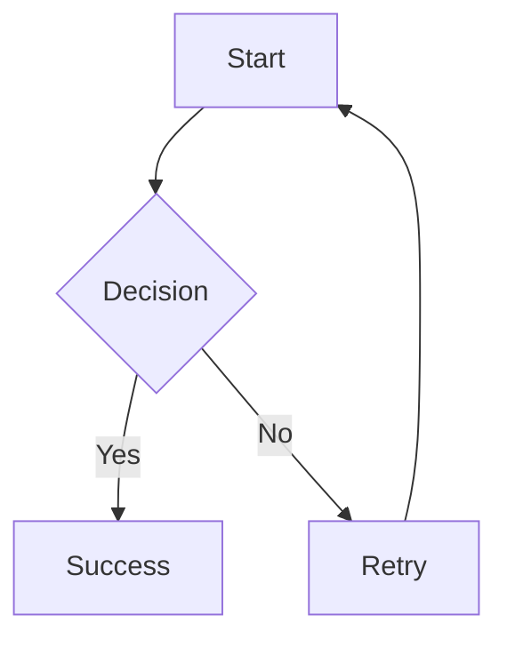
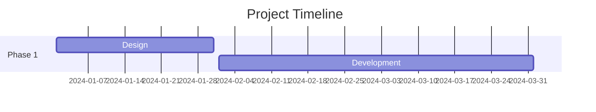

# MDNotes Pro

> Professional Markdown Editor with Advanced Presentation & Visualization Capabilities


**🎉 NEW in v2.1.0**: Notion-style block editor, hierarchical file system, bidirectional editing, interactive tables, smart task lists, timeline visualization, and offline support!

## 🌟 What's New in v2.1.0

- 📦 **Notion-Style Block Editor** - Toggle between Markdown and Blocks modes with full keyboard shortcuts
- 🗂️ **Hierarchical File System** - Notion-like folders, tags, favorites, and archive
- 🔄 **Bidirectional Editing** - Click preview to jump to editor source
- 🎯 **Mindmap Focus** - Active node highlighting with animations
- 📊 **Interactive Tables** - Sort, filter, and export to CSV
- ✅ **Smart Task Lists** - Checkboxes with progress bars
- 📅 **Timeline Visualization** - Beautiful timesheet.js timelines
- 💾 **Offline Support** - Local library management for full offline capability
- 📚 **Enhanced Documentation** - Complete deployment and usage guides

[📖 See Full Release Notes](RELEASE.md) | [📋 View Changelog](CHANGELOG.md)

## ✨ Features

### 🗂️ File Management
- **Hierarchical Folders** - Organize files in nested folder structure
- **Smart Tags** - Auto-colored tags for categorization
- **Favorites & Archive** - Quick access to important files
- **Advanced Search** - Filter by folder, tag, or status
- **Multi-file Support** - Work with multiple documents
- **Auto-save** - Never lose your work

### ✍️ Editor
- **Dual Editor Modes** - Toggle between Markdown and Notion-style Blocks
- **CodeMirror Integration** - Professional code editing with syntax highlighting
- **Markdown Toolbar** - Quick formatting buttons
- **Keyboard Shortcuts** - Efficient editing workflow (Ctrl+B/I/K/S/N)
- **Fullscreen Mode** - Distraction-free writing
- **Text Statistics** - Lines, words, and character count
- **Cursor Tracking** - Synchronized across all panels

### 📦 Block Editor (NEW!)
- **10 Block Types** - Text, H1/H2/H3, Todo, Bullet, Numbered, Quote, Code, Toggle
- **Slash Commands** - Type `/` to open command menu
- **Keyboard Shortcuts** - Enter, Backspace, Tab, Shift+Tab, Arrow keys
- **Auto-save** - Persistent storage with IndexedDB
- **Markdown Conversion** - Seamless conversion between Markdown ↔ Blocks
- **Hierarchical Blocks** - Indent/outdent for nested structure
- **ContentEditable** - Native browser editing with custom styling

### 👁️ Preview
- **Live Rendering** - Real-time markdown preview
- **Bidirectional Editing** - Click to jump to source
- **Syntax Highlighting** - Code blocks with highlight.js
- **Mermaid Diagrams** - Flowcharts, sequences, Gantt charts
- **Chart.js Integration** - Data visualization
- **Interactive Tables** - Sort, filter, export to CSV
- **Smart Task Lists** - Checkboxes with progress tracking
- **Timeline Visualization** - Timesheet.js timelines
- **Fullscreen Mode** - Focus on your content

### 🎤 Presentations
- **Reveal.js Powered** - Professional slide presentations
- **JSON Templates** - 4 customizable templates (corporate/modern/academic/startup)
- **Full Customization** - Colors, fonts, logo, footer
- **Multiple Themes** - 10+ built-in themes
- **Content Auto-fitting** - Slides adjust to content
- **Fullscreen Mode** - Present like a pro
- **Export to PDF** - Save slides as PDF
- **Export to PowerPoint** - PPTX with template support

### 🧠 Mindmap
- **Auto-generation** - From document headings
- **Active Node Focus** - Highlight current node with animations
- **Interactive** - Pan, zoom, explore
- **Synchronized** - Tracks cursor position in editor
- **Export SVG/PNG** - Save visualizations
- **Fullscreen Mode** - Better visualization

### 📤 Export Formats
- **.md** - Markdown
- **.html** - Standalone HTML
- **.pdf** - Preview & Slides (programmatic generation)
- **.docx** - Microsoft Word (programmatic generation)
- **.pptx** - PowerPoint with template support
- **.csv** - Tables export
- **.svg/.png** - Mindmap export

### 📊 Diagrams & Visualizations
- **Mermaid Flowcharts** - Process diagrams
- **Sequence Diagrams** - Interaction flows
- **Gantt Charts** - Project timelines
- **Timeline Diagrams** - Historical events
- **Journey Maps** - User journeys
- **Timesheet Timelines** - Visual project timelines with JSON
- **Chart.js Charts** - Bar, line, pie, doughnut, radar, and more

### 🎨 Themes
- **Dark** (default) - Professional dark theme
- **Light** - Clean light theme
- **Dracula** - Popular developer theme
- **Nord** - Arctic color palette
- **Monokai** - Classic code editor theme

### 💾 Offline Support
- **Local Libraries** - Download all dependencies locally
- **No CDN Required** - Works completely offline
- **npm Script** - `npm run download-libs` to vendor libraries
- **6-8 MB Total** - All 27 libraries included

## 🚀 Quick Start

### Option 1: Use Pre-built Version (Recommended)

1. Open `dist/index.html` in your browser
2. Start writing!

No installation, no dependencies, no setup required.

### Option 2: Development Setup

```bash
# Clone the repository
git clone https://github.com/yourusername/mdnotes.git
cd mdnotes

# Build from source
npm run build

# Or start development mode with auto-rebuild
npm run watch

# Or start dev server
npm run dev
```

## 📚 Usage

### Creating Documents

1. Click **+ New** to create a new file
2. Write your markdown in the editor
3. Toggle **Preview** to see live rendering
4. Toggle **Mindmap** to visualize structure

### Creating Presentations

1. Separate slides with `---`
2. Click **Present** to enter presentation mode
3. Use arrow keys to navigate slides
4. Press **Esc** to exit

Example:
```markdown
# Slide 1

Content here

---

## Slide 2

More content

---

## Slide 3

Final slide
```

### Adding Diagrams

#### Mermaid Flowchart
~~~markdown

~~~

#### Gantt Timeline
~~~markdown

~~~

#### Chart.js Bar Chart
~~~markdown
```chart
{
  "type": "bar",
  "data": {
    "labels": ["Q1", "Q2", "Q3", "Q4"],
    "datasets": [{
      "label": "Revenue",
      "data": [12, 19, 15, 25],
      "backgroundColor": "rgba(0, 122, 204, 0.6)"
    }]
  }
}
```
~~~

### Keyboard Shortcuts

| Shortcut | Action |
|----------|--------|
| `Ctrl/Cmd + S` | Save file |
| `Ctrl/Cmd + N` | New file |
| `Ctrl/Cmd + B` | Bold |
| `Ctrl/Cmd + I` | Italic |
| `Ctrl/Cmd + K` | Insert link |

### Export

1. Click **Export** button
2. Choose format:
   - **Markdown** - Plain .md file
   - **HTML** - Standalone HTML with inline styles
   - **PDF (Preview)** - Current preview as PDF
   - **PDF (Slides)** - Presentation slides as PDF
   - **PowerPoint** - .pptx file

## 🏗️ Project Structure

```
mdnotes/
├── src/                    # Source files
│   ├── css/               # Stylesheets
│   │   ├── variables.css  # CSS variables & themes
│   │   ├── base.css       # Base styles
│   │   ├── components.css # Component styles
│   │   └── modals.css     # Modal dialogs
│   ├── js/                # JavaScript modules
│   │   ├── modules/       # Core modules
│   │   │   ├── storage.js
│   │   │   ├── theme.js
│   │   │   ├── file-manager.js
│   │   │   ├── editor.js
│   │   │   ├── preview.js
│   │   │   ├── mindmap.js
│   │   │   ├── presentation.js
│   │   │   └── export.js
│   │   ├── extensions/    # Extensions
│   │   │   ├── charts.js
│   │   │   └── timeline.js
│   │   └── app.js         # Main application
│   └── html/              # HTML components
│       ├── template.html  # Main template
│       ├── modals.html    # Modal dialogs
│       └── icons.html     # SVG icons
├── build/                 # Build scripts
│   ├── build.js          # Production build
│   └── watch.js          # Development watcher
├── dist/                  # Built files
│   └── index.html        # Single-file app
├── package.json          # Project config
├── README.md             # This file
├── TODO.md               # Task list
└── CLAUDE.md             # AI assistant guide
```

## 🛠️ Development

### Building

```bash
# Production build
npm run build

# Development mode with watch
npm run watch

# Dev server on port 8000
npm run dev
```

### Modifying

The project uses a modular architecture:

1. **Edit source files** in `src/`
2. **Run build** to compile to `dist/index.html`
3. **Test** by opening `dist/index.html` in browser

### Adding a New Theme

1. Edit `src/css/variables.css`:
```css
[data-theme="mytheme"] {
    --bg-primary: #...;
    --bg-secondary: #...;
    /* ... */
}
```

2. Edit `src/js/modules/theme.js`:
```javascript
themes: {
    mytheme: { /* ... */ }
}
```

3. Rebuild: `npm run build`

### Adding a New Feature

1. Create module in `src/js/modules/` or `src/js/extensions/`
2. Import and initialize in `src/js/app.js`
3. Add UI elements to `src/html/template.html`
4. Add styles to appropriate CSS file
5. Rebuild: `npm run build`

## 📦 External Libraries

All libraries loaded via CDN (no npm install needed for usage):

- **marked.js** - Markdown parsing
- **CodeMirror** - Code editor
- **Reveal.js** - Presentations
- **Mermaid.js** - Diagrams
- **Chart.js** - Charts
- **markmap** - Mindmaps
- **d3.js** - Visualization
- **html2canvas** - Screenshots
- **jsPDF** - PDF generation
- **PptxGenJS** - PowerPoint export
- **highlight.js** - Syntax highlighting

## 🤝 Contributing

Contributions are welcome! Please:

1. Fork the repository
2. Create a feature branch
3. Make your changes
4. Test thoroughly
5. Submit a pull request

## 📄 License

MIT License - see LICENSE file for details

## 🙏 Acknowledgments

- Built with amazing open-source libraries
- Inspired by modern markdown editors
- Designed for productivity and elegance

## 📞 Support

- **Issues**: [GitHub Issues](https://github.com/yourusername/mdnotes/issues)
- **Discussions**: [GitHub Discussions](https://github.com/yourusername/mdnotes/discussions)
- **Documentation**: See `CLAUDE.md` for detailed technical docs

## 🗺️ Roadmap

See [TODO.md](TODO.md) for planned features and improvements.

---

**Made with ❤️ for markdown lovers**
