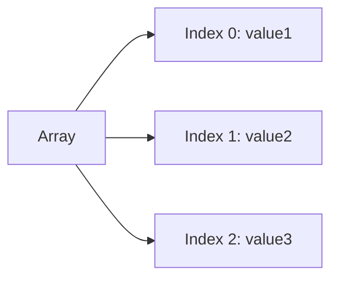
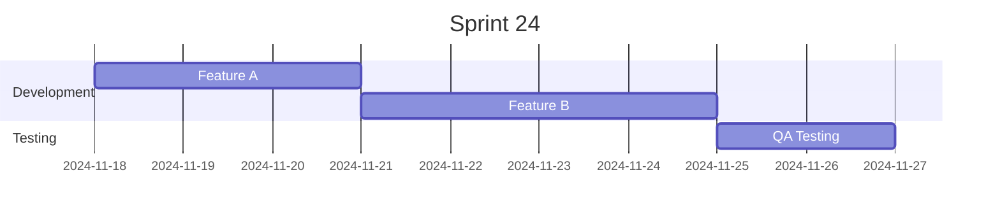
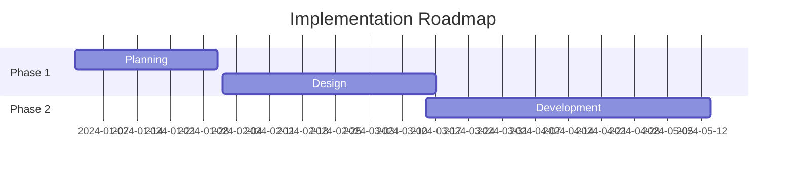
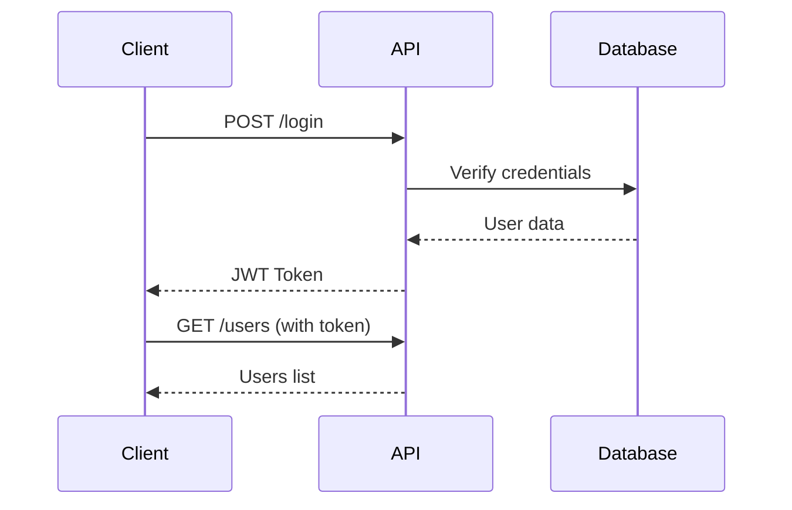
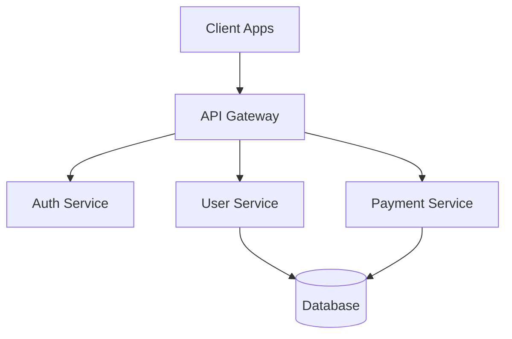
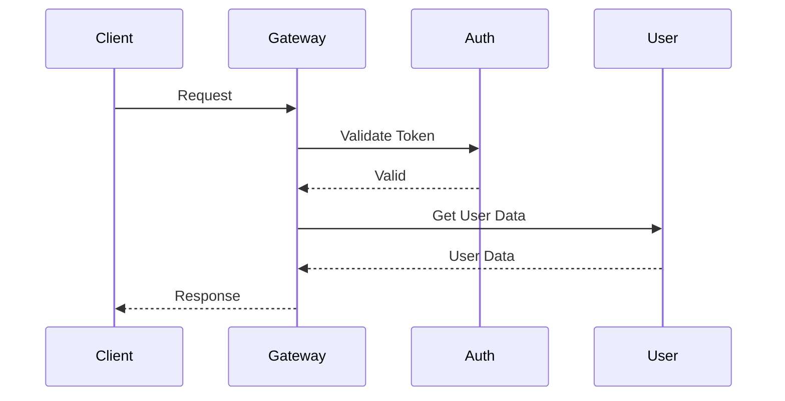
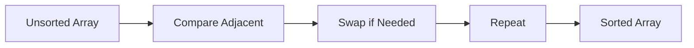
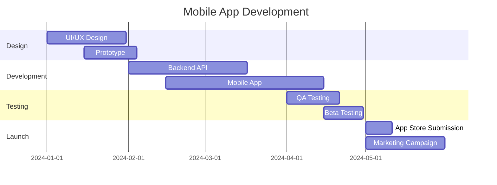

# MDNotes Pro - Use Cases & Examples

> Detailed use cases and workflows for different user types

## Table of Contents

- [Students & Researchers](#students--researchers)
- [Professionals & Business](#professionals--business)
- [Developers & Technical Writers](#developers--technical-writers)
- [Writers & Content Creators](#writers--content-creators)
- [Educators & Trainers](#educators--trainers)
- [Project Managers](#project-managers)
- [Data Analysts](#data-analysts)

---

## Students & Researchers

### Use Case 1: Lecture Notes Organization

**Scenario:** Computer Science student taking notes during semester

**Setup:**
```
📁 Root
  📁 CS101 - Data Structures
    📄 Week 1 - Introduction.md
    📄 Week 2 - Arrays and Lists.md
    📄 Week 3 - Stacks and Queues.md
  📁 MATH201 - Calculus
  📁 PHYS102 - Physics
```

**Workflow:**
1. **During Lecture:**
   - Use Markdown mode for quick note-taking
   - Add code examples with syntax highlighting
   - Insert Mermaid diagrams for visualizations

2. **After Lecture:**
   - Switch to Block editor for reorganization
   - Add task lists for homework items
   - Tag notes by topic (#algorithms, #datastructures)
   - Favorite important lectures

3. **Before Exam:**
   - Generate mindmap from all notes
   - Export to PDF for offline reading
   - Create presentation slides for study group

**Example Content:**
```markdown
# Week 2 - Arrays and Lists

## Arrays

Arrays are contiguous memory structures:

```python
# Array example
numbers = [1, 2, 3, 4, 5]
print(numbers[0])  # Output: 1
```

## Time Complexity

| Operation | Array | Linked List |
|-----------|-------|-------------|
| Access    | O(1)  | O(n)        |
| Insert    | O(n)  | O(1)        |
| Delete    | O(n)  | O(1)        |

## Visualization



## Homework
- [ ] Complete exercise 2.1
- [ ] Read chapter 3
- [ ] Practice problems on LeetCode
```

---

### Use Case 2: Research Paper Writing

**Scenario:** Graduate student writing thesis

**Features Used:**
- Hierarchical folders for chapters
- Block editor for structured writing
- Export to DOCX for submission
- Bidirectional editing for citations

**Workflow:**
```
1. Create outline in Block editor
2. Write sections in Markdown mode
3. Add references with task lists
4. Generate mindmap for paper structure
5. Export to DOCX with formatting
6. Create presentation for defense
```

**Example Structure:**
```markdown
# Thesis Title

---

## Chapter 1: Introduction

### 1.1 Background

[Research context...]

### 1.2 Problem Statement

[Problem description...]

## References

- [ ] Smith et al. (2023) - Deep Learning
- [ ] Jones (2022) - Neural Networks
- [x] Brown (2021) - Machine Learning
```

---

## Professionals & Business

### Use Case 1: Meeting Notes & Action Items

**Scenario:** Project manager documenting weekly team meeting

**Setup:**
```
📁 Meetings
  📁 2024-Q4
    📄 Week 45 - Sprint Planning.md
    📄 Week 46 - Retrospective.md
    📄 Week 47 - Stakeholder Update.md
```

**Example Content:**
```markdown
# Sprint Planning - Week 45

**Date:** 2024-11-18
**Attendees:** Sarah, Mike, Lisa, Tom
**Tags:** #sprint #planning #q4

## Agenda

1. Review last sprint
2. Plan new sprint
3. Address blockers

## Action Items

### High Priority
- [ ] @Mike: Deploy feature X by Friday
- [ ] @Lisa: Review API documentation
- [ ] @Sarah: Schedule client meeting

### Medium Priority
- [ ] @Tom: Update test coverage
- [ ] @All: Code review sprint 23

## Sprint Goals

```chart
{
  "type": "bar",
  "data": {
    "labels": ["Week 45", "Week 46", "Week 47"],
    "datasets": [{
      "label": "Story Points",
      "data": [23, 28, 25],
      "backgroundColor": "#6366f1"
    }]
  }
}
```

## Timeline



## Next Steps

1. Send meeting notes to team
2. Update Jira with action items
3. Schedule follow-up for Friday
```

**Toast Notification Example:**
```javascript
// After saving meeting notes
Toast.success('Meeting notes saved and shared!');
```

---

### Use Case 2: Client Presentation

**Scenario:** Consultant creating quarterly business review

**Features Used:**
- Custom presentation templates
- Chart.js for metrics
- PowerPoint export
- Company branding

**Workflow:**
```
1. Write presentation in Markdown
2. Add charts for KPIs
3. Insert Gantt charts for timeline
4. Apply custom company template
5. Export to PPTX
6. Present to client
```

**Example Slides:**
```markdown
# Q4 Business Review
## Company Name

---

## Key Metrics

```chart
{
  "type": "line",
  "data": {
    "labels": ["Jan", "Feb", "Mar", "Apr"],
    "datasets": [{
      "label": "Revenue Growth",
      "data": [45000, 52000, 48000, 61000]
    }]
  }
}
```

---

## Project Timeline



---

## Next Quarter Goals

- Increase revenue by 20%
- Launch 3 new features
- Expand team by 5 members
```

---

## Developers & Technical Writers

### Use Case 1: API Documentation

**Scenario:** Developer documenting REST API

**Example Content:**
```markdown
# User API Documentation

## Authentication

All API requests require authentication via Bearer token:

```bash
curl -H "Authorization: Bearer YOUR_TOKEN" \
  https://api.example.com/users
```

## Endpoints

### GET /users

Retrieve all users.

**Request:**
```json
{
  "page": 1,
  "limit": 10
}
```

**Response:**
```json
{
  "users": [
    {
      "id": 1,
      "name": "John Doe",
      "email": "john@example.com"
    }
  ],
  "total": 100
}
```

## API Flow



## Error Codes

| Code | Description |
|------|-------------|
| 200  | Success |
| 401  | Unauthorized |
| 404  | Not Found |
| 500  | Server Error |

## Testing

- [ ] Unit tests complete
- [ ] Integration tests complete
- [ ] Load testing complete
```

---

### Use Case 2: Architecture Documentation

**Scenario:** System architect documenting microservices architecture

**Features Used:**
- Mermaid diagrams
- Code blocks
- Mindmap generation
- HTML export for wiki

**Example Content:**
```markdown
# System Architecture

## Overview

Our system uses a microservices architecture with:
- API Gateway
- Authentication Service
- User Service
- Payment Service
- Notification Service

## Architecture Diagram



## Service Communication



## Technology Stack

- **Frontend:** React, TypeScript
- **Backend:** Node.js, Express
- **Database:** PostgreSQL, Redis
- **Infrastructure:** Docker, Kubernetes
```

---

## Writers & Content Creators

### Use Case 1: Blog Post Writing

**Scenario:** Content creator writing technical blog post

**Workflow:**
```
1. Draft outline in Block editor
2. Write content in Markdown
3. Add code examples with highlighting
4. Insert charts for data
5. Generate mindmap for structure
6. Export to HTML for CMS
```

**Example Content:**
```markdown
# 10 Tips for Better Code Reviews

## Introduction

Code reviews are essential for maintaining code quality...

## Tips

### 1. Review Small Pull Requests

Keep PRs under 400 lines of code for better focus.

```javascript
// Good: Small, focused change
function calculateTotal(items) {
  return items.reduce((sum, item) => sum + item.price, 0);
}
```

### 2. Use Checklists

- [ ] Code follows style guide
- [ ] Tests are included
- [ ] Documentation updated
- [ ] No security vulnerabilities

## Progress Tracking

We've improved our review process:

```chart
{
  "type": "bar",
  "data": {
    "labels": ["Jan", "Feb", "Mar"],
    "datasets": [{
      "label": "Review Time (hours)",
      "data": [12, 8, 5]
    }]
  }
}
```

## Conclusion

Following these tips will improve your code review process...
```

---

## Educators & Trainers

### Use Case 1: Interactive Lesson Plans

**Scenario:** Teacher creating computer science lesson

**Example Content:**
```markdown
# Lesson: Introduction to Sorting Algorithms

## Learning Objectives

- [ ] Understand bubble sort
- [ ] Implement selection sort
- [ ] Compare time complexity
- [ ] Practice with examples

## Bubble Sort Explanation

```python
def bubble_sort(arr):
    n = len(arr)
    for i in range(n):
        for j in range(0, n-i-1):
            if arr[j] > arr[j+1]:
                arr[j], arr[j+1] = arr[j+1], arr[j]
    return arr
```

## Visualization



## Performance Comparison

| Algorithm | Best | Average | Worst |
|-----------|------|---------|-------|
| Bubble    | O(n) | O(n²)   | O(n²) |
| Selection | O(n²)| O(n²)   | O(n²) |
| Quick     | O(n log n) | O(n log n) | O(n²) |

## Student Assessment

- [ ] Quiz completed (20 points)
- [ ] Coding exercise (30 points)
- [ ] Project submission (50 points)

Progress: 60% complete
```

---

## Project Managers

### Use Case: Project Planning

**Example Content:**
```markdown
# Project: Mobile App Launch

## Timeline



## Milestones

- [x] Design approved
- [x] Backend complete
- [ ] App development (80% complete)
- [ ] Testing phase
- [ ] Launch

## Team

| Name | Role | Tasks |
|------|------|-------|
| Sarah | Designer | UI/UX |
| Mike | Backend | API |
| Lisa | Mobile | iOS/Android |
| Tom | QA | Testing |

## Budget Tracking

```chart
{
  "type": "pie",
  "data": {
    "labels": ["Development", "Design", "Testing", "Marketing"],
    "datasets": [{
      "data": [40, 25, 15, 20],
      "backgroundColor": ["#6366f1", "#8b5cf6", "#10b981", "#f59e0b"]
    }]
  }
}
```
```

---

## Data Analysts

### Use Case: Data Analysis Reports

**Example Content:**
```markdown
# Sales Analysis Q4 2024

## Executive Summary

Sales increased 23% compared to Q3...

## Sales by Region

```chart
{
  "type": "bar",
  "data": {
    "labels": ["North", "South", "East", "West"],
    "datasets": [{
      "label": "Q4 Sales ($K)",
      "data": [450, 320, 510, 380]
    }]
  }
}
```

## Trend Analysis

```chart
{
  "type": "line",
  "data": {
    "labels": ["Oct", "Nov", "Dec"],
    "datasets": [{
      "label": "Revenue",
      "data": [420, 485, 655],
      "borderColor": "#6366f1"
    }]
  }
}
```

## Key Metrics

| Metric | Q3 | Q4 | Change |
|--------|----|----|--------|
| Revenue | $1.2M | $1.66M | +23% |
| Customers | 450 | 580 | +29% |
| Avg Order | $2,667 | $2,862 | +7% |

## Action Items

- [ ] Increase marketing in South region
- [ ] Launch loyalty program
- [ ] Expand product line
```

---

## Tips for All Users

### Keyboard Shortcuts Mastery
```
Global:
- Cmd/Ctrl + S → Save
- Cmd/Ctrl + N → New file
- Cmd/Ctrl + B → Toggle sidebar
- Cmd/Ctrl + 1-4 → Switch tabs

Editor:
- Ctrl + B → Bold
- Ctrl + I → Italic
- Ctrl + K → Link
```

### Organization Best Practices

1. **Use Folders:** Group related documents
2. **Tag Everything:** Makes searching easier
3. **Favorite Important Files:** Quick access
4. **Regular Archives:** Keep workspace clean
5. **Consistent Naming:** Use clear file names

### Export Strategies

- **PDF:** For sharing and printing
- **DOCX:** For collaboration in Word
- **HTML:** For web publishing
- **PPTX:** For presentations
- **MD:** For version control

### Toast Notifications Usage

```javascript
// Success feedback
Toast.success('Document exported successfully!');

// Error handling
Toast.error('Failed to save. Please try again.');

// Warnings
Toast.warning('Low disk space. Consider archiving old files.');

// Info messages
Toast.info('New feature available: Interactive tables!');
```

---

## Advanced Workflows

### Workflow 1: Documentation Pipeline

```
Markdown → Preview → Mindmap → Export HTML → Publish
```

### Workflow 2: Presentation Creation

```
Outline (Blocks) → Content (Markdown) → Charts → Slides → PPTX
```

### Workflow 3: Research Paper

```
Notes (Markdown) → Organization (Blocks) → References → Export DOCX
```

### Workflow 4: Project Planning

```
Task Lists → Gantt Charts → Status Tracking → Client Reports
```

---

## Conclusion

MDNotes Pro adapts to your workflow, whether you're a student, professional, developer, writer, or educator. The combination of Markdown editing, block-based organization, visualizations, and export options makes it a versatile tool for any knowledge work.

**Start with the basics, then explore advanced features as needed!**

---

*For more examples, visit [https://paulingjini.github.io/mdnotes/](https://paulingjini.github.io/mdnotes/)*
